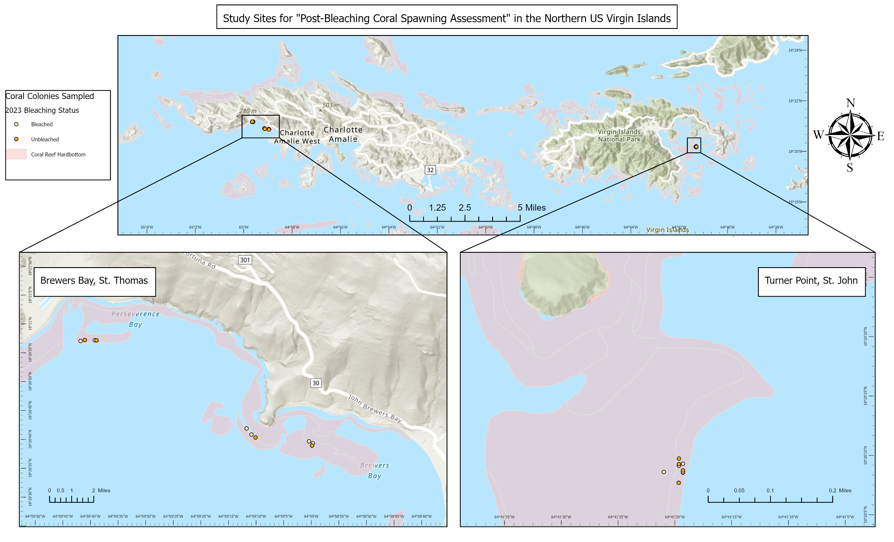

```{r setup, include=FALSE}
knitr::opts_chunk$set(echo = FALSE, warning = FALSE, message = FALSE)
```

```{r}
#Install package "ggmosaic"

#Load libraries
library(readxl)
library(dplyr)
library(ggplot2)
library(tidyr)
library(ggmosaic)
library(tidyverse)
```

## Spawn-less Summer: Post-Bleaching Coral Spawning Assessment

#### You may have heard of Silent Spring, but have you ever thought about a Spawn-less Summer? This thesis project aims to uncover the impacts of coral bleaching on reproduction in the US Virgin Islands.

Below is a map of the observed coral colonies for this study.



These coral colonies were monitored for bleaching status during the consecutive 2023 and 2024 bleaching events.

A Chi-squared test was conducted to show proportions of bleaching status for each year. The results of the Chi-squared test below were not significant, which tell us that corals are not being hardened by the previous year's bleaching event. This is not good!

*X-squared = 1.8544, df = 1, p-value = 0.1733*

```{r}
#Load data
BlStatus <- readxl::read_excel("MasterData.xlsx", sheet = "2324FAKEbleachingstatus")
```

```{r message=FALSE}
#Do chi squared test
BleachingStatus <- BlStatus%>%
  rename("Start_Status" = "2023_Status")%>%
  rename("Final_Status" = "2024_Status")%>%
  filter(!(Start_Status == "WP"))%>%
  filter(!(Start_Status == "half bleached"))

BlStatusContTable <- xtabs(~ Start_Status + Final_Status, data = BleachingStatus)

#Pearson's Chi-squared test
chisq.test(BlStatusContTable, correct = FALSE)
```

```{r}
#Visualize results with mosaic plot at population level
mosaic_examp <- ggplot(data = BleachingStatus) +
  geom_mosaic(aes(x = product(Start_Status, Final_Status), fill= Start_Status)) +   
  labs(y="2023 Bleaching Status", x="2024 Bleaching Status", title = "Colony Bleaching Status", fill = "2023 Bleaching Status") +
  theme_mosaic()

mosaic_examp
```

I'm not sure about you, but I don't have the ability to cool down the sea (please let me know if you do). The good news is we can still do something to help corals. We can decrease local stressors so corals have a better chance of survival during these intense bleaching events. We can also bring corals into land-based holding facilities for safe keeping of their genetics until the world sorts itself out.
